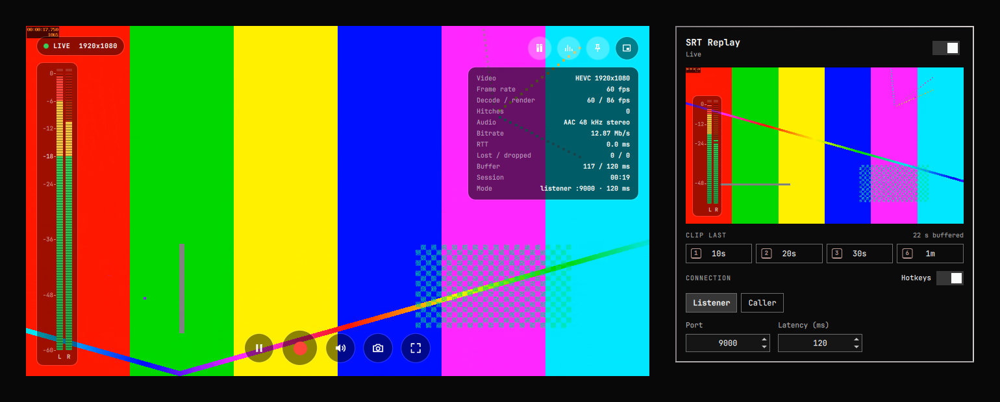

# SRT Replay

Receive an SRT stream in the Omarchy bar: preview it, record it, and clip the
last few seconds with one click or one key.



- **Bar button** with a quick-config panel: listener or caller mode, port,
  latency, and a copyable `srt://` URL for your encoder.
- **Player** docked in the panel, or popped out into a floating window that
  stays on every workspace. It has a translucent auto-hiding overlay with
  play/pause, record, mute and volume, snapshot, fullscreen, pin, a stats
  HUD, and broadcast-style audio meters.
- **Recording** to MKV, and **clips** of the last 10 s, 20 s, 30 s or 1 min
  from a rolling replay buffer. Nothing is ever re-encoded.
- **Optional hotkeys:** `1` `2` `3` `6` save clips from any app while a
  stream is live.

Requires Omarchy 4 (Quattro).

## Install

```sh
omarchy plugin add https://github.com/ChachizR/omarchy-srt-replay.git --enable
```

The button is added to the right side of the bar. Move it with:

```sh
omarchy bar move io.github.chachizr.srt-replay --section center
```

## Dependencies

All of these are normally already present on an Omarchy install. If one is
missing, install it with your usual package tool.

| Package | Used for |
| --- | --- |
| `srt` | `srt-live-transmit`: owns the SRT connection and reports link stats |
| `ffmpeg` | Copying the stream to the player, recorder, meters and replay buffer; saving clips |
| `qt6-multimedia-ffmpeg` | Video and audio playback inside the shell |
| `jq` | Checking Hyprland state for hotkeys and the pin button |
| `libnotify` | "Recording saved" / "Clip saved" notifications |
| `wl-clipboard` | The panel's **Copy** button |
| `xdg-utils` | Opening the Recordings, Clips and Snapshots folders |
| `iproute2` | Finding the LAN address shown in the listener URL |

## Usage

**Bar button:** left click opens the panel, right click starts or stops SRT,
middle click starts or stops recording. The icon is dim when off, pulses while
waiting for a sender, uses your accent colour when live, and pulses red while
recording.

**Panel:** switch SRT on, then point your encoder (OBS, Larix, vMix…) at the
URL shown under **CONNECTION**, or pick **Caller** and enter the remote host.
Press Escape or click outside to close it.

**Player keys** (in the pop-out window): `Space` play/pause · `R` record ·
`M` mute · `↑`/`↓` volume · `S` snapshot · `I` stats · `V` audio meters ·
`F` or double-click fullscreen · `Esc` leave fullscreen or dock. Drag the
video to move the window.

**Pausing** freezes the last frame and rejoins the live edge when you resume.
Recording keeps running while playback is paused.

**Where files go** (the folders can be changed in the settings below):

| What | Where |
| --- | --- |
| Recordings | `~/Videos/SRT/srt-<time>.mkv` |
| Clips | `~/Videos/SRT/Clips/srt-clip-<time>-<length>.mkv` |
| Snapshots | `~/Pictures/SRT/srt-<time>.png`, at the stream's native resolution |

### Clips

The **CLIP LAST** buttons save the most recent part of the stream, whether or
not you're recording.

- **Replay buffer:** while SRT is on, the last 75 s are kept in RAM, in
  `$XDG_RUNTIME_DIR/srt-replay`. That's about 110 MB at 12 Mb/s. It's cleared
  when you stop SRT or a new sender connects. It survives a sender
  disconnecting, so you can still clip the end of a stream.
- **Clip length:** a clip starts on a keyframe, so it can run up to one
  keyframe interval longer than requested. A 1–2 s keyframe interval in your
  encoder keeps clips tight.
- **Stuck streams:** if a stream stops sending keyframes (video drops but
  audio continues), the buffer resets with a notification instead of growing.
  Sources with keyframes more than 30 s apart can't be clipped.

### Clip hotkeys

Turn on **Hotkeys** in the panel. While a stream is live, `1`, `2`, `3` and
`6` save the last 10 s, 20 s, 30 s and 1 min from any app, and the clip
buttons show matching keycaps.

While active, those four digits are captured and don't type in other apps.
Turn the toggle off when you need them.

### Command line

```sh
omarchy-shell srt-replay toggle      # start or stop SRT
omarchy-shell srt-replay record      # start or stop recording
omarchy-shell srt-replay clip 30     # save the last 30 s (1-65)
omarchy-shell srt-replay snapshot    # prints the saved path
omarchy-shell srt-replay popout|dock|fullscreen|play|mute|stats|meters
omarchy-shell srt-replay hotkeys     # toggle the clip hotkeys setting
omarchy-shell srt-replay controls    # keep the overlay visible, or auto-hide
omarchy-shell srt-replay status      # JSON status
omarchy-shell shell toggle io.github.chachizr.srt-replay '{}'   # open the panel
```

Example keybinding in `~/.config/hypr/bindings.lua`:

```lua
o.bind("SUPER + ALT + S", "SRT Replay", "omarchy-shell shell toggle io.github.chachizr.srt-replay '{}'")
```

## Configure

Omarchy stores the settings on the plugin's bar entry in
`~/.config/omarchy/shell.json`. The connection and hotkey settings can also be
changed from the panel.

| Setting | Default | Meaning |
| --- | --- | --- |
| `mode` | `"listener"` | `"listener"` waits for a sender; `"caller"` connects to `callerHost` |
| `port` | `9000` | SRT port |
| `latency` | `120` | Receiver latency in ms |
| `callerHost` | `""` | Remote host for caller mode |
| `recordDir` | `""` | Recordings folder; empty means `~/Videos/SRT` |
| `snapshotDir` | `""` | Snapshots folder; empty means `~/Pictures/SRT` |
| `autoStart` | `"Off"` | `"On"` starts SRT when the shell starts |
| `replayBuffer` | `"On"` | `"Off"` disables the replay buffer and clips |
| `clipHotkeys` | `"Off"` | `"On"` enables the `1` `2` `3` `6` clip hotkeys |

Connection settings are locked while recording. Changing them restarts SRT,
which drops the current sender.

## What it does on your system

SRT Replay runs as your user inside the Omarchy shell. Nothing needs root, and
it doesn't edit any configuration files.

- **Network:** while SRT is on, listener mode accepts SRT on the configured
  UDP port (default 9000) on all interfaces; caller mode connects only to the
  host you enter. The stream is passed between the plugin's own processes over
  local UDP ports on `127.0.0.1` (30000–60000). The LAN address shown in the
  panel is read from the routing table, without sending any traffic.
- **Processes:** while SRT is on it runs `srt-live-transmit` and up to five
  `ffmpeg` processes (relay, recorder, meters, replay buffer, clip). All of
  them stop when you switch SRT off or the plugin unloads.
- **Hyprland:** at runtime it adds a window rule for its pop-out window. Only
  while hotkeys are on and a stream is live, it also adds key bindings for
  `1` `2` `3` `6`. Both are removed when no longer needed, and when the plugin
  unloads. Any stale bindings from a shell crash are cleared on the next
  start. Removing its bindings also removes any other unmodified binding on
  those four digit keys.
- **Files:** it writes recordings, clips and snapshots only to the folders
  above, and the replay buffer only to `$XDG_RUNTIME_DIR/srt-replay`.
- **Desktop:** it sends notifications, and copies the URL to the clipboard
  only when you press **Copy**.

## Remove

```sh
omarchy plugin remove io.github.chachizr.srt-replay
```

Your recordings, clips and snapshots are kept. Delete `~/Videos/SRT` and
`~/Pictures/SRT` yourself if you no longer want them.

## How it works

```
srt-live-transmit   SRT socket, link stats
   └─ udp 127.0.0.1
ffmpeg -c copy      relay; probes codec, resolution and frame rate
   ├─ QtMultimedia player (low-latency)
   ├─ ffmpeg -c copy -> MKV recording (while recording)
   ├─ ffmpeg astats -> audio meters (while meters are shown)
   └─ ffmpeg segment -> replay buffer -> bin/srt-replay -> MKV clips
```

| File | Purpose |
| --- | --- |
| `manifest.json` | Plugin manifest: bar widget plus a service |
| `Service.qml` | Pipeline, player, recorder, replay buffer, hotkeys, pop-out window, IPC |
| `BarWidget.qml` | Bar button and panel |
| `PlayerView.qml` | Video, overlay controls and stats HUD |
| `AudioMeters.qml` | Audio meters |
| `OverlaySurface.qml`, `OverlayButton.qml` | Translucent overlay surfaces and buttons |
| `Icon.qml`, `Icons.js` | Vector icons, no icon font needed |
| `bin/srt-replay` | Replay buffer pruning and clip remuxing |
| `bin/srt-window` | Pin toggle for the pop-out window |

If you change the plugin's files, run `omarchy restart shell` to load the
changes.

## License

[MIT](LICENSE)
